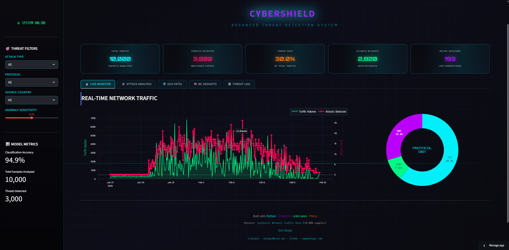

# 🛡️ CyberShield - Threat Detection Dashboard
A ML powered cybersecurity threat detection and analysis dashboard built with Python and Streamlit. Features real time network traffic monitoring, anomaly detection using Isolation Forest, and attack classification using Random Forest with 95% accuracy.

## Live Demo

**[Launch the App](https://cybershield-dashboard-sammybolger.streamlit.app/)**

## App Preview

---

## Features

- **Real time network monitoring with live traffic visualization
- **ML powered threat detection using Isolation Forest for anomaly detection
- **Attack classification with Random Forest (95% accuracy across 7 attack types)
- **Geographic threat intelligence with interactive world map
- **Interactive filtering by attack type, protocol, and source country
- **Detailed threat logs with export capabilities
- **Dark cyber themed UI with animated grid background and scan line effects

---

## Attack Types Detected

- **Attack Type	Description
- **DDoS	Distributed Denial of Service attacks
- **Port Scan	Network reconnaissance attempts
- **SQL Injection	Database exploitation attempts
- **Brute Force	Password cracking attempts
- **Malware	Malicious software communication
- **Phishing	Social engineering attacks
- **Man-in-Middle	Traffic interception attempts

---

## Machine Learning Models

- **Isolation Forest (Anomaly Detection)
- **Unsupervised learning for detecting unusual network patterns
- **Identifies zero day threats and unknown attack vectors
- **Random Forest Classifier (Attack Classification)
- **100 decision tree estimators
- **95% classification accuracy across 7 attack categories

---

## Technologies Used

Python 3.11+
Streamlit for interactive web dashboard
scikit-learn for machine learning models
Plotly for interactive visualizations
Pandas / NumPy for data processing

---

## How to Run
git clone https://github.com/SammyBolger/cybershield-dashboard.git
cd cybershield-dashboard
pip install -r requirements.txt
streamlit run app.py

--- 

## Dataset

Synthetic network traffic data (10,000 samples) modeled after the Network Intrusion Detection Dataset on Kaggle.

## Contact
LinkedIn: Sam Bolger
Email: sbolger@cord.edu
Portfolio: sammybolger.com
